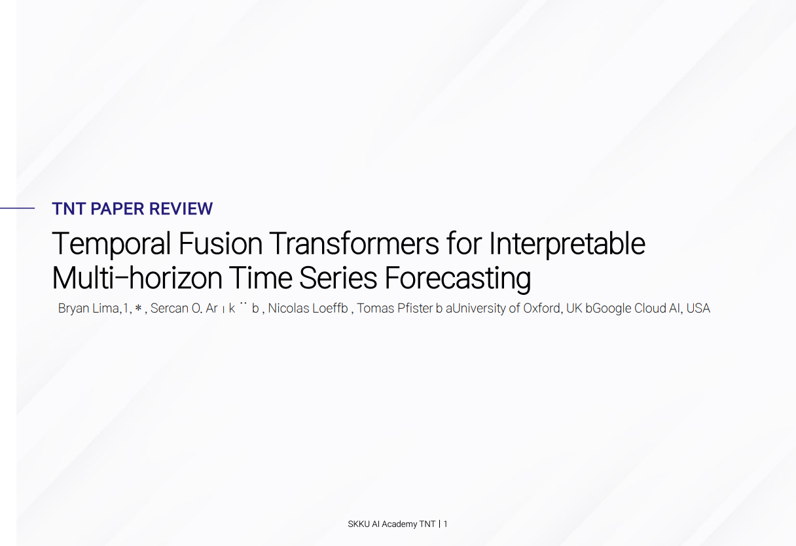
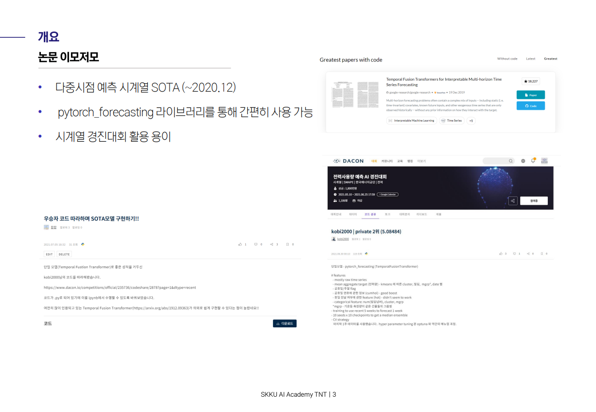
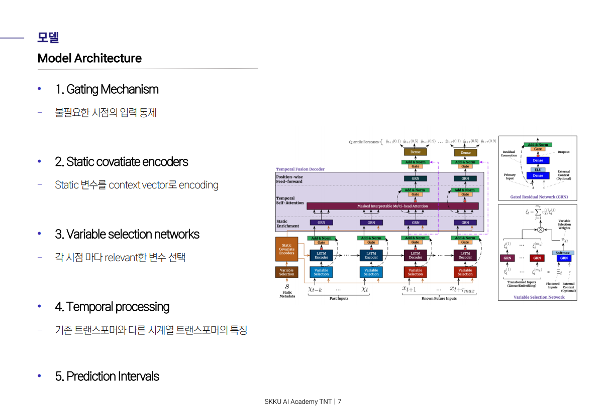
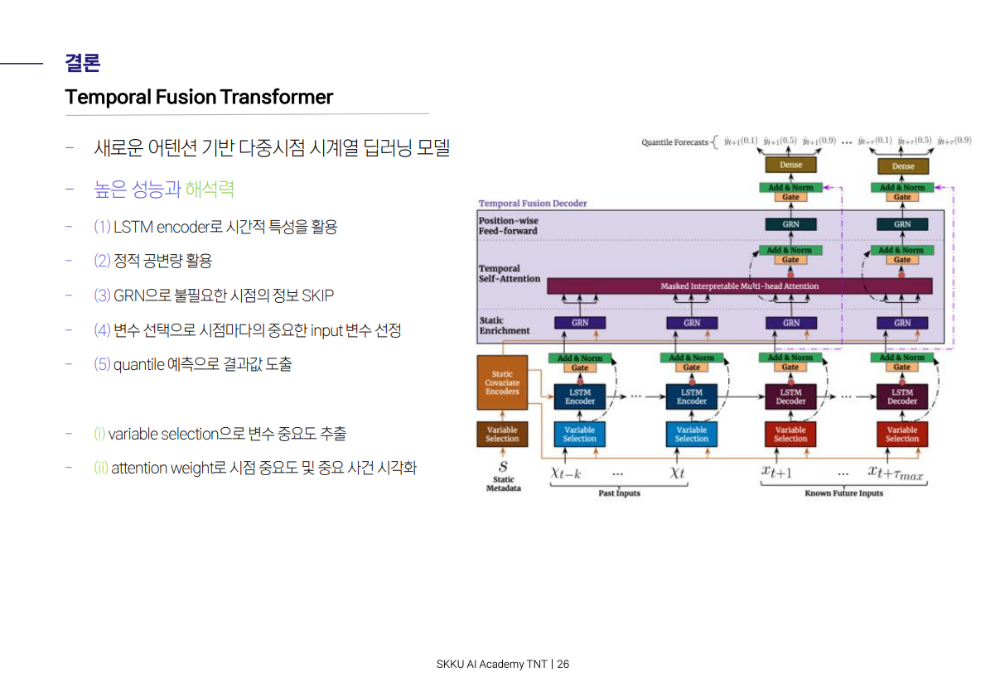

## TNT PAPER REVIEW
# **Temporal Fusion Transformers**

 

- [논문 바로가기](https://arxiv.org/abs/1912.09363)

 

   
  
  
  
  
  
  
  
  
  
  
  
  
  
  
  
  
  
  
  
  
  
  
  

 

## 대회 소개 (Introduction)

### **1. 배경**

    
+ 신용카드사는 신용카드 신청자가 제출한 개인정보와 데이터를 활용해 신용 점수를 산정합니다. 신용카드사는 이 신용 점수를 활용해 신청자의 향후 채무 불이행과 신용카드 대급 연체 가능성을 예측합니다.
+ 현재 많은 금융업계는 인공지능(AI)를 활용한 금융 서비스를 구현하고자 합니다. 사용자의 대금 연체 정도를 예측할 수 있는 인공지능 알고리즘을 개발해 금융업계에 제안할 수 있는 인사이트를 발굴해주세요!

 

### 2. 주제

+ 신용카드 사용자 데이터를 보고 사용자의 대금 연체 정도를 예측하는 알고리즘 개발 
+ 신용카드 사용자들의 개인 신상정보 데이터로 사용자의 신용카드 대금 연체 정도를 예측

 

## 주최/주관

- 주최: DACON
- 주관: DACON

 

## 규칙

1. 심사 기준: logloss (MultiClass)
2. 외부 데이터 및 사전 학습 모델

* 외부 데이터 사용 前 토론 게시판에 문의 要

 

## 목차 (Table of Contents)

 

**개발 단계** - raw_data부터 대회용 데이터까지의 경과

1. [대회 개발](./1.%20Develop)
2. [대회 데이터 다운](https://www.dacon.io/competitions/official/235713/data)

 

**베이스라인** - 참여자들의 제출을 가능케하는 데이콘 베이스라인

3. [베이스라인](./3.%20Baseline)

 

**심화 코드**  

4. [심화 코드](./4.%20Answer_code)

